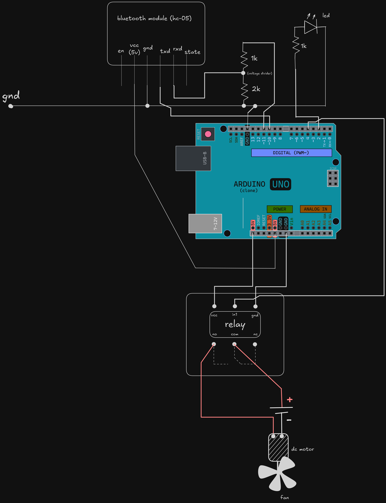

# vexis
> **vocal-to-state hardware execution bridge.**

`vexis` is a minimalist interface designed to map wireless audio triggers to physical environmental states. it prioritizes low-latency execution and high-reliability switching.

---

### logic
the system operates on a linear execution pipeline:
* **capture**: vocal input is processed into serialized data strings.
* **transmit**: data is bridged via a 2.4ghz wireless link to the processing core.
* **parse**: logic core identifies commands and maps them to specific output pins.
* **execute**: high-side switching matrix toggles physical peripheral states.

---

### architecture
the project utilizes a modular design for isolated power management and signal integrity:


* **logic core**: arduino uno for string comparison and i/o management.
* **wireless interface**: bluetooth-to-serial bridge for remote command reception.
* **switching matrix**: relay-driven mechanical interface for peripheral control.
* **feedback loop**: led-based visual indicator for state confirmation.

---

### tech
```yaml
core:      arduino uno (atmega328p)
protocol:  uart / bluetooth serial
interface: spdt relay / 1k:2k resistor-ladder divider
power:     isolated dc rail / 5v logic
```

### architecture

